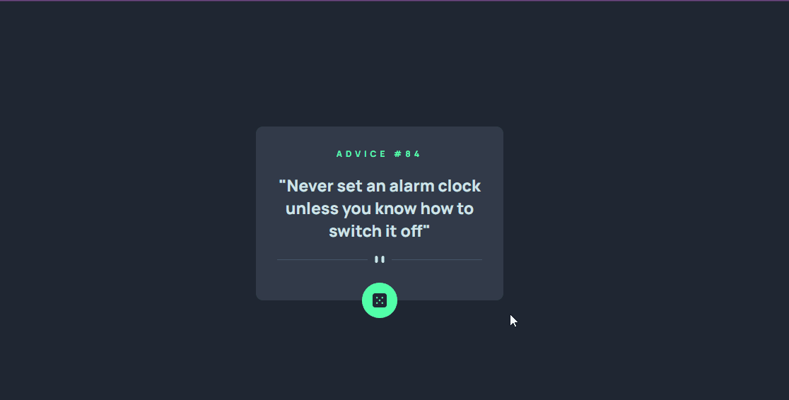

# Frontend Mentor - Advice generator app solution

Esta é uma solução para o [Advice generator app challenge on Frontend Mentor](https://www.frontendmentor.io/challenges/advice-generator-app-QdUG-13db).

## Table of contents

- [Overview](#overview)
  - [O desafio](#o-desafio)
  - [Screenshot](#screenshot)
  - [Links](#links)
  - [Como rodar](#como-rodar)
- [Meu processo](#meu-processo)
  - [Feito com](#feito-com)
  - [O que aprendi](#o-que-aprendi)
- [Autor](#autor)

## Overview

### O Desafio

Usuários devem ser capaz de ver:

- Ver o design responsivo em diferentes tamanhos de tela
- Ver os hover states em todos os elementos iterativos
- Gerar um novo conselho ao clicar no dado

### Screenshot



### Links

- Solution URL: [Vercel](https://your-solution-url.com)
- Live Site URL: [Github](https://your-live-site-url.com)

### Como rodar
Depois de clonar o repositório basta executar os seguintes comandos:

Se você usa yarn
```javascript
   yarn install && yarn start 
```
ou se usa npm
```javascript
  npm install && npm start 
```

## Meu processo

### Feito com

- Semantic HTML5 markup
- Flexbox
- Mobile-first workflow
- [React](https://reactjs.org/) - JS library
- [Styled Components](https://styled-components.com/) - For styles
- [Axios](https://axios-http.com/ptbr/docs/intro) - for API requests

### O que aprendi

Consolidei os conhecimentos de css como posicionamento e estilização, e os conhecimentos básicos de react como criação e utilização de componentes, hooks como o useState e o useEffect.

## Author

- Website - [Gabriel Mascarenhas](https://rialbeg.github.io/portfolio/)
- Frontend Mentor - [@rialbeg](https://www.frontendmentor.io/profile/rialbeg)
- Linkedin - [@gsamascarenhas](https://www.linkedin.com/in/gsamascarenhas/)
